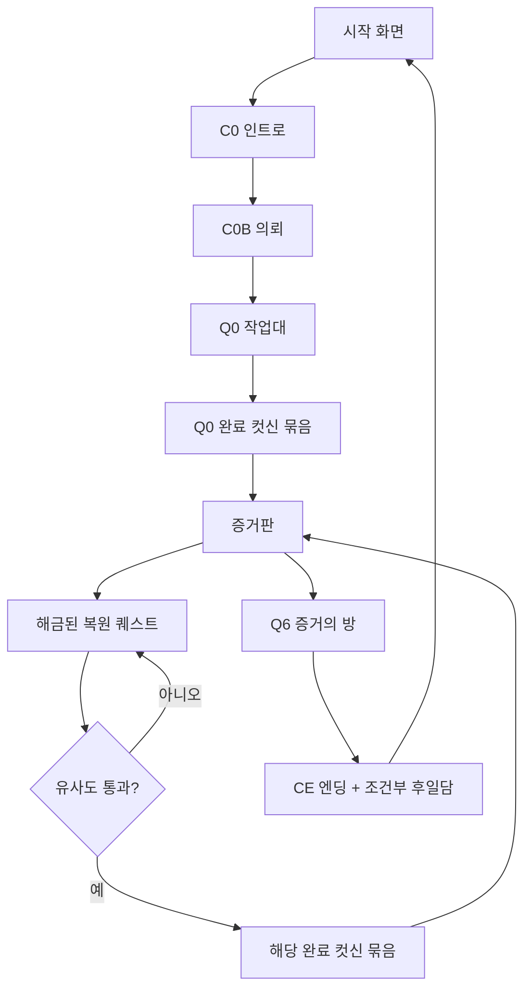

# 《안개항의 상속자》 단일 게임 통합 실행 계획

> 상태: 구현 인수인계용 정본
> 기준일: 2026-08-10
> 선행 문서: `PROJECT_STRUCTURE.md`, `RESTORATION_QUEST_SPEC.md`,
> `script/07_CUTSCENES.md`, `QUEST_BRANCH.md`
> 목표: 시작 화면부터 엔딩까지 새로고침·직접 URL 이동 없이 하나의 게임 셸에서 완주한다.

## 0. 최종 사용자 흐름



화면은 다섯 종류만 존재한다.

1. `title`
2. `cutscene`
3. `board`
4. `workbench`
5. `finale`

오류·로딩은 별도 게임 화면이 아니라 위 화면에 겹치는 상태다.

## 1. 통합 원칙

### 1.1 단일 셸

- 제품 진입점은 루트 `index.html` 하나다.
- `location.href`로 `board.html`이나 `workbench.html`로 이동하지 않는다.
- 화면 전환은 `GameDirector.transition(nextState)`만 수행한다.
- 개발 fixture만 URL 쿼리를 사용한다.
- 브라우저 뒤로 가기가 게임 상태를 되돌리지 않도록 제품 화면마다 history entry를 만들지 않는다.

### 1.2 정본은 하나씩만

- 진행 구조: `src/data/quest-graph.js`
- 복원 이미지·팔레트·메모·채점: `src/data/questimage-quests.js`
- 컷신 bundle·scene·beat: 새 `src/data/cutscene-bundles.js`
- 사용자 진행 메타데이터: 새 `ProgressStore`
- 작업 중·완성 그림 Blob: 새 `ArtworkStore`

같은 제목, 자산 경로, 해금 관계를 화면별 파일에 복사하지 않는다.

### 1.3 기존 구현을 한 번에 다시 쓰지 않는다

현재 IIFE/전역 방식은 통합 완료까지 유지한다. 새 코드는 `window.HavenGame` 아래에만 공개한다.
모든 세로 슬라이스가 통과한 뒤 ES module 전환 여부를 별도 결정한다. 통합 도중 모듈 시스템까지
바꾸면 경로·로드 순서·기능 회귀를 동시에 추적해야 한다.

### 1.4 완료와 컷신 종료는 다른 사건

- 그림 통과: 퀘스트 `cleared`
- 컷신 전체 묶음 종료: bundle `completed`
- 자식 해금: bundle 종료 시점

그림 통과 직후 앱을 닫아도 다음 실행에서 완료 컷신부터 재개해야 한다.

## 2. 목표 코드 구조

```text
src/
├── app/
│   ├── bootstrap.js
│   ├── game-director.js
│   └── game-shell.js
├── core/
│   ├── asset-loader.js
│   ├── event-bus.js
│   ├── progress-store.js
│   ├── artwork-store.js
│   └── migration-v1-v2.js
├── data/
│   ├── quest-graph.js
│   ├── questimage-quests.js
│   ├── completion-bundles.js
│   └── cutscene-bundles.js
├── screens/
│   ├── title-screen.js
│   ├── board-screen.js
│   ├── workbench-screen.js
│   ├── cutscene-screen.js
│   └── finale-screen.js
├── cutscenes/
│   ├── cutscene-player.js
│   ├── cutscene-input.js
│   ├── cutscene-text.js
│   ├── renderers/
│   │   ├── opening.js
│   │   ├── l0-l1.js
│   │   ├── l1-l2.js
│   │   ├── l2-l3.js
│   │   ├── l3-l4.js
│   │   ├── l4-l5.js
│   │   ├── l5-l6.js
│   │   └── ending.js
│   └── data/
│       └── beats-*.js
└── workbench/
    ├── workbench-controller.js
    ├── highres-canvas.js
    ├── closed-regions.js
    ├── paint-history.js
    ├── restoration-scorer.js
    └── clip-service.js
```

초기 단계에서는 기존 파일을 바로 이동하지 말고 새 위치에서 adapter로 호출한다. 새 경로가
검증되면 기존 파일을 제거한다.

## 3. 진행·저장 계약

### 3.1 `ProgressStore` 버전 2

`localStorage`에는 작은 메타데이터만 저장한다.

```js
{
  version: 2,
  clearedQuestIds: [],
  completedBundleIds: [],
  seenSceneIds: [],
  flags: [],
  selectedQuestId: null,
  pending: null | {
    kind: "completion-cutscene",
    sourceQuestId,
    bundleId
  },
  updatedAt
}
```

API:

```text
getSnapshot()
isQuestCleared(questId)
isBundleCompleted(bundleId)
beginQuestCompletion(questId, bundleId)
completeBundle(bundleId, grants, unlocks)
selectQuest(questId)
getPendingTransition()
clearPendingTransition()
reset()
subscribe(listener)
```

`beginQuestCompletion`은 퀘스트 완료와 pending bundle 기록을 한 번의 저장으로 수행한다.
`completeBundle`은 scene/bundle 완료, grants 적용과 pending 제거를 한 번의 저장으로 수행한다.

### 3.2 그림 저장은 IndexedDB

1254×1254 RGBA 한 장은 약 6.3MB이므로 `localStorage`에 넣지 않는다.

DB 이름: `heir_artworks_v1`

스토어:

- `drafts`: 퀘스트별 작업 중 상태
- `finals`: 통과 당시 PNG/WebP Blob
- `thumbnails`: 증거판용 160×160 Blob

레코드 공통 필드:

```js
{
  questId,
  schemaVersion,
  imageVersion,
  width: 1254,
  height: 1254,
  blob,
  updatedAt
}
```

초기 MVP는 PNG Blob을 저장한다. 저장 용량 문제가 확인되면 lossless WebP를 사용한다.
정답 이미지, CLIP 모델 결과, 내부 점수는 저장하지 않는다.

### 3.3 재개 우선순위

앱 부팅 시 다음 순서를 고정한다.

1. `pending completion-cutscene`가 있으면 그 bundle 재생
2. 오프닝 미완료면 다음 오프닝 컷신
3. 선택된 미완료 퀘스트 draft가 있으면 증거판에서 “작업 계속” 표시
4. 그 외에는 증거판
5. 어떤 저장도 없으면 시작 화면

오류가 난 컷신은 completed로 기록하지 않는다. “다시 시도”와 이미 본 장면만 가능한
“건너뛰기”를 제공한다.

## 4. 컷신 ID와 번들 정규화

현재 `quest-graph.js`는 완료 컷신을 한 ID로 표현하지만 제작본은 한 퀘스트 완료 뒤 두 장면을
연속 재생하기도 한다. `node.cutscene`을 직접 사용하지 말고 `completion-bundles.js`를 새 정본으로
추가한다.

| 완료 퀘스트 | bundle ID | 제작 scene 순서 | 새로 여는 퀘스트 |
| --- | --- | --- | --- |
| Q0 | `B_AFTER_Q0` | `C1A_RETURNED_HEIR`, `C1B_TWELVE_YEARS_UNDER` | Q1A, Q1B |
| Q1A | `B_AFTER_Q1A` | `C2C_RAIN_BEHIND_THE_DOOR`, `C2A_HOLTS_MEMORY` | Q2C, Q2A |
| Q1B | `B_AFTER_Q1B` | `C2B_MIST_IS_MISSING` | Q2B |
| Q2A | `B_AFTER_Q2A` | `C3A_CARVERS_CREST`, `C3B_FRESH_ANCHOR` | Q3A, Q3B |
| Q2B | `B_AFTER_Q2B` | `C3C_FOLLOW_THE_FLYER` | Q3C |
| Q2C | `B_AFTER_Q2C` | `C2C_OPEN_DOOR_CLOSING` | 없음 |
| Q3A | `B_AFTER_Q3A` | `C4A_LEDGER_TRAIL`, `C4C_SQUARE_CHALLENGE` | Q4A, Q4C |
| Q3B | `B_AFTER_Q3B` | `C3B_TOO_NEW_CLOSING` | 없음 |
| Q3C | `B_AFTER_Q3C` | `C4B_CAT_FOUND_PAPERS` | Q4B |
| Q4A | `B_AFTER_Q4A` | `C5A_CARRIAGE_WITNESS` | Q5A |
| Q4B | `B_AFTER_Q4B` | `C5B_SIREN_WITNESS` | Q5B |
| Q4C | `B_AFTER_Q4C` | `C4C_PAINTER_CLOSING` | 없음 |
| Q5A | `B_AFTER_Q5A` | `C6_EVIDENCE_WALL` | Q6 |
| Q5B | `B_AFTER_Q5B` | `C5B_THAT_NIGHT_CLOSING` | 없음 |
| Q6 | `B_AFTER_Q6` | `CE_ENDING` | 종료 |

기존 `QuestGraph.UNLOCKS`의 옛 alias는 마이그레이션과 검증용으로만 유지한다. 제품 진행은
bundle의 `unlocks`를 사용한다. 두 데이터가 다르면 부팅 테스트가 실패해야 한다.

`completion-bundles.js` 스키마:

```js
{
  id,
  sourceQuestId,
  sceneIds,
  grants,
  unlocks,
  replayable: true
}
```

## 5. 공통 컷신 플레이어

검토 JS 7개는 재생·입력·텍스트 코드가 중복되지만 시각 렌더링은 서로 다르다. 모든 것을
하나의 거대한 renderer로 합치지 않는다.

### 5.1 공통화할 책임

`cutscene-player.js`:

- 자산 preload와 실패 보고
- bundle playlist 순서
- beat 시간과 progress
- 타자 효과
- SPACE: 현재 문장 완성/다음
- ESC: 이미 본 scene만 skip
- R: bundle 처음부터
- 입력 잠금
- 장면 사이 fade
- pause/resume과 탭 비활성 처리
- `onSceneComplete`, `onBundleComplete`, `onError`

### 5.2 renderer에 남길 책임

각 `renderers/<layer>.js`:

- 640×384 art canvas 그리기
- 배경·인물·인서트 배치
- 해당 묶음만의 비·안개·번개·카메라 효과
- beat의 `view`, `face`, `effect` 해석
- fixture에 따른 조건부 소품

renderer 인터페이스:

```text
preload(assetLoader) -> Promise<void>
enterScene(scene, context)
renderBeat(scene, beat, elapsed, context)
leaveScene(scene, context)
dispose()
```

### 5.3 데이터 추출 순서

1. `dev/cutscenes/cutscene-review-l0-l1.js`를 첫 샘플로 분리
2. 검토 페이지가 새 player+renderer를 호출하도록 변경
3. 화면과 대사가 기존 검토본과 동일한지 비교
4. L1→L2부터 엔딩까지 한 묶음씩 이전
5. 마지막에 C0/C0B를 같은 인터페이스 adapter로 감싼다

검토 페이지가 계속 작동해야 제품 통합 중 컷신 시각 회귀를 찾을 수 있다.

## 6. 단일 게임 셸과 `GameDirector`

### 6.1 `index.html` 변경

현재 title, intro, C0B, Q0 작업대 DOM을 다음 셸로 일반화한다.

```html
<main data-screen="title"></main>
<main data-screen="cutscene" hidden></main>
<main data-screen="board" hidden></main>
<main data-screen="workbench" hidden></main>
<main data-screen="finale" hidden></main>
<div data-role="loading-overlay" hidden></div>
<div data-role="fatal-error" hidden></div>
```

기존 CSS의 화면별 최상위 class는 유지해 시각 회귀를 줄인다.

### 6.2 Director 상태

```text
boot
title
cutscene:{bundleId, sceneIndex}
board
workbench:{questId}
finale
fatal:{reason, retryAction}
```

필수 메서드:

```text
startNewGame()
continueGame()
showTitle()
playBundle(bundleId)
showBoard()
openQuest(questId)
openFinale()
handleQuestPassed(result)
recoverPendingTransition()
disposeCurrentScreen()
```

전환 중 중복 클릭을 막는 단일 lock을 둔다. 화면 dispose가 끝나기 전에 다음 화면을 mount하지
않는다. 이전 화면의 keydown, resize, animation frame, interval을 모두 해제한다.

### 6.3 기존 파일 adapter

- `intro.js`: title과 C0/C0B 시작 버튼을 Director 호출로 바꾼 뒤 단계적으로 축소
- `index-workbench.js`: URL 파라미터와 `location.href` 제거, `WorkbenchScreen` adapter로 대체
- `board-entry.js`: 제품 모드에서 개발 bar 제거, 선택 시 `GameDirector.openQuest(id)` 호출
- `workbench-flow.js`: URL 반환 대신 bundle ID를 반환하거나 Director를 호출

## 7. 고해상도 작업대 제품화

### 7.1 Q1A 실험에서 유지할 것

- 1254×1254 네이티브 좌표
- 검은 선 기준 4방향 폐곡선 라벨링
- 영역 채우기
- 16/36/72px 붓·지우개
- 60~160% 확대
- 선 밖으로 번지지 않는 붓
- 투명 선화 overlay
- 색 유사도·채색률·선택적 CLIP
- CLIP 실패 시 로컬 점수 fallback

### 7.2 제품용으로 바꿀 것

- 테스트 HTML DOM 의존 제거
- QA용 “완성본 보기/적용”은 `HAVEN_DEBUG`에서만 생성
- 전체 ImageData 5장을 저장하는 이력 제거
- 최소 20단계 patch/region command 이력
- pointer와 touch 동일 처리
- 화면을 나가면 draft 자동 저장
- 제출 중 입력 잠금과 취소 불가 처리
- 결과 수치 비공개, 정성 피드백만 표시
- 통과 시 final Blob과 thumbnail 저장 후 Director에 결과 전달

### 7.3 이력 명령 형식

```js
// 채우기
{ type: "fill-region", regionId, beforeColor, afterColor }

// 붓·지우개
{ type: "patch", x, y, width, height, before, after }
```

한 stroke가 여러 pointermove를 포함해도 이력은 하나다. 메모리 상한을 byte 단위로 관리하고
최소 20단계를 보장한다.

### 7.4 점수 계약

기본:

```text
최종 = 색 유사도 70% + 채색률 15% + CLIP 15%
CLIP 불가 = 색 유사도 82% + 채색률 18%
최초 통과선 = 60
```

- 선 픽셀은 평가에서 제외
- 흰색 미채색은 색 유사도 0으로 처리
- 필수 부위 하드 실패 없음
- CLIP timeout은 8~12초 범위에서 결정하고 제출 자체는 실패시키지 않음
- Q1A에서 시작해 14개 노드의 실제 플레이 분포로 통과선을 조정
- 통과선 변경은 계약 데이터만 수정하고 scorer 코드는 바꾸지 않음

### 7.5 14개 퀘스트 등록

`questimage-quests.js`의 계약을 `QuestGraph.NODES`와 join한다. 별도 구형
`WorkbenchQuestConfig`를 14번 복사하지 않는다.

부팅 검증:

- finale를 제외한 14개 그래프 노드 모두 계약 존재
- 계약 ID와 그래프 ID 동일
- target/outline 실제 파일 존재
- 두 이미지 모두 1254×1254
- 팔레트 1~8색
- 증언 1개 이상
- 가중치 합 1
- completion bundle 존재

## 8. 증거판 통합

기존 `BranchMap`의 시각 디자인은 유지한다.

변경 사항:

- `board.html` DOM을 `index.html`의 board screen으로 이동
- `BoardScreen.mount(container, {progressStore, artworkStore, onSelect})`
- 완료 카드의 임의 색 썸네일 대신 `ArtworkStore.thumbnails` 사용
- 결과가 없는 구 세이브만 target 기반 저해상도 fallback 사용
- 열린 노드만 클릭 가능
- 완료 노드는 컷신 다시 보기와 그림 다시 보기 메뉴 제공
- Q6은 `FinaleScreen`으로 연결
- 개발 진행 bar는 `dev/workbench/progress-test.html`에만 존재

BoardScreen dispose 시 1초 interval과 store subscription을 반드시 해제한다.

## 9. Q6와 엔딩

Q6는 복원 퀘스트가 아니므로 `questimage` 계약 대상이 아니다.

### 9.1 Q6 증거의 방

- 본선 여섯 장을 ArtworkStore에서 읽는다.
- 누락 Blob은 `assets/cutscenes/l5-l6/evidence` fallback을 사용한다.
- 플레이어가 증거 카드를 지정된 연결점에 연결한다.
- 정답 완료 후 `B_AFTER_Q6`를 pending으로 저장한다.
- Q6 도중 종료 시 연결 상태를 ProgressStore 또는 IndexedDB에 저장한다.

### 9.2 엔딩 fixture 제거

`dev/cutscenes/cutscene-review-l6-ending.js`의 URL fixture 대신 실제 완료 퀘스트 집합을 넘긴다.

```text
Q2C → EPI_OPEN_DOOR
Q3B → EPI_TATTOO_CONFESSION
Q3C → EPI_CAT_AT_WINDOW
Q4C → EPI_RAM_COPIES
Q5B → EPI_LAST_PAINTING
```

엔딩 bundle 완료 후 마지막 저장을 먼저 하고 시작 화면을 연다. 새 게임은 별도 확인을 거쳐
ProgressStore와 ArtworkStore를 함께 초기화한다.

## 10. 구현 단계와 커밋 경계

### 단계 0 — 회수본 보존

작업:

- 현재 회수된 L2→엔딩 파일 전체를 체크포인트 커밋
- `assets/questimage` 이동과 `dev/` 이동 포함
- 자동 테스트와 모든 검토 HTML 로드 확인

완료 조건:

- 다른 Codex 작업 트리를 삭제해도 현재 브랜치에 제작물이 남음
- Git status clean

### 단계 1 — 계약과 검증기

생성:

- `src/data/completion-bundles.js`
- `tests/completion-bundles.test.cjs`
- `tests/runtime-asset-paths.test.cjs`

수정:

- `quest-graph.js`에 `completionBundleId` 추가
- 옛 `cutscene`은 migration alias로 표시

완료 조건:

- 14개 복원 노드 + Q6 모두 bundle 매핑
- graph/bundle/image 계약 교차 검증 통과

### 단계 2 — ProgressStore v2와 ArtworkStore

생성:

- `src/core/progress-store.js`
- `src/core/artwork-store.js`
- `src/core/migration-v1-v2.js`
- 저장 단위 테스트

완료 조건:

- 기존 `heir_game_progress_v1` 저장을 잃지 않음
- pending bundle crash recovery 테스트 통과
- 1254 PNG와 160 thumbnail round trip 통과

### 단계 3 — 공통 컷신 플레이어 세로 슬라이스

대상: Q0 완료 → `B_AFTER_Q0` → 증거판

작업:

- L0→L1 데이터를 player/renderer로 추출
- `dev/cutscenes/cutscene-review-l0-l1.html`을 새 모듈에 연결
- Q0 통과 뒤 같은 bundle을 제품 셸에서 재생

완료 조건:

- 검토본과 제품본의 beat 수·대사·자산 키 동일
- 컷신 중 새로고침 후 bundle 처음부터 재개
- 완료 뒤 Q1A/Q1B 해금

### 단계 4 — 단일 셸

작업:

- `GameDirector`, `GameShell` 생성
- board와 workbench를 `index.html`에 mount
- 제품의 `location.href` 제거
- `board.html`, `workbench.html`은 아직 fallback으로 유지

완료 조건:

- title→C0→C0B→Q0→C1→board가 페이지 새로고침 없이 진행
- 각 화면 전환 뒤 이전 RAF/listener/interval 0개

### 단계 5 — Q1A 고해상도 본편 이식

작업:

- 기존 작업대 디자인에 고해상도 controller 연결
- command history와 draft 저장
- Q1A 통과 → `B_AFTER_Q1A` → board

완료 조건:

- QA 완성본 적용 없이 실제 도구로 제출 가능
- 실패 시 그림 유지
- 통과 시 final/thumbnail 저장
- Q2A/Q2C 해금

이 단계가 전체 게임 통합의 두 번째 세로 슬라이스다. 여기까지 통과하기 전 나머지 13개
퀘스트를 동시에 등록하지 않는다.

### 단계 6 — 모든 컷신 묶음 이전

순서:

1. L1→L2
2. L2→L3
3. L3→L4
4. L4→L5
5. L5→L6
6. 엔딩

각 묶음마다 data 추출 → renderer 추출 → dev 검토 회귀 → 제품 bundle 등록 → 테스트 순서다.

### 단계 7 — 나머지 13개 복원 퀘스트 등록

권장 순서:

1. 본선: Q2A, Q3A, Q4A, Q5A
2. 직렬 가지: Q1B, Q2B, Q3C, Q4B, Q5B
3. 단발 가지: Q2C, Q3B, Q4C
4. 마지막으로 Q0를 새 `questimage` 기반으로 교체

각 퀘스트마다 확인:

- 이미지 계약
- 증언 메모
- 폐곡선 수와 채우기
- 팔레트
- 빈/부분/근접/정답 점수 fixture
- 완료 bundle
- 자식 해금
- thumbnail

### 단계 8 — Q6·엔딩

- 실제 저장된 여섯 증거 사용
- 본선 완주
- 다섯 후일담 조건
- 엔딩 뒤 이어하기/새 게임

### 단계 9 — 호환 파일 제거

전제: 전체 완주 E2E 통과.

- `board.html`, `workbench.html` 제거 또는 dev 이동
- 구 Q0 런타임과 `assets/q0-montage` 제거
- `intro.js`, `index-workbench.js`, `workbench-flow.js`의 adapter 제거
- `LEGACY_DELETION_MANIFEST.md` A등급을 범주별 승인·삭제

### 단계 10 — 최종 QA

아래 매트릭스를 자동화한다.

| 경로 | 필수 결과 |
| --- | --- |
| 새 게임 본선 | Q0→Q1A→Q2A→Q3A→Q4A→Q5A→Q6→엔딩 |
| 선술집 가지 | Q1B→Q2B→Q3C→Q4B→Q5B |
| 단발 가지 | Q2C, Q3B, Q4C 독립 완료 |
| 재개 | 각 작업대 draft, 통과 직후, 컷신 도중, Q6 도중 |
| 실패 | 이미지 404, IndexedDB 실패, CLIP 실패, 저장 quota |
| 접근성 | 키보드, reduced motion, live region, 포커스 복귀 |
| 화면 | 1280×720, 1440×900, 좁은 화면, 고DPI |

## 11. 테스트 파일 계획

추가할 테스트:

```text
tests/completion-bundles.test.cjs
tests/cutscene-registry.test.cjs
tests/progress-store-v2.test.cjs
tests/artwork-store.test.cjs
tests/game-director.test.cjs
tests/runtime-asset-paths.test.cjs
tests/all-quest-scoring-fixtures.test.cjs
tests/full-game-main-route.e2e.js
tests/full-game-branch-route.e2e.js
tests/resume-points.e2e.js
```

브라우저 E2E에서는 디버그 API를 제품 UI에 노출하지 않고 테스트 빌드에서만 fixture adapter를
주입한다. CLIP 모델은 E2E 기본 경로에서 mock score를 쓰고, 별도 수동 테스트에서 실제 모델을
한 번 확인한다.

## 12. 성능 예산

- 첫 화면 JS 실행: 컷신·questimage 전체를 preload하지 않음
- 현재 화면 자산만 lazy load
- 다음 bundle 배경만 idle preload
- 작업대 원본 두 장: 해당 퀘스트 진입 시 로드
- 1254 canvas: DPR에 따라 물리 크기를 늘리지 않고 원본 1254 고정
- closed-region 분석: 퀘스트당 한 번, 가능하면 Worker로 이전
- CLIP: 사용자 선택 또는 첫 제출 시 lazy load
- 화면 dispose 뒤 ImageBitmap·Object URL 해제
- IndexedDB thumbnail은 160×160 이하

성능 계측을 `performance.mark`로 남긴다.

```text
app_boot
screen_ready:<screen>
quest_assets_ready:<id>
region_map_ready:<id>
submit_scored:<id>
cutscene_assets_ready:<bundle>
```

## 13. 실패 처리

- 자산 404: 경로와 quest/bundle ID를 표시하고 재시도
- target만 실패: 제출 비활성, 그림은 계속 저장
- outline 실패: 작업대 진입 중단
- CLIP 실패: 로컬 색 점수로 자동 전환
- IndexedDB 실패: 세션 메모리로 계속 플레이하되 저장 불가 경고
- ProgressStore 쓰기 실패: 완료 화면으로 넘어가지 않고 재시도
- renderer 예외: 해당 bundle 미완료 유지, 검토 페이지 링크를 개발 로그에 출력

어떤 오류도 자식 퀘스트를 먼저 해금하지 않는다.

## 14. Claude Code 인수인계 지침

Claude Code는 다음 순서를 바꾸지 않는다.

1. `PROJECT_STRUCTURE.md`와 이 문서를 읽는다.
2. 현재 Git status와 회수 컷신 파일이 모두 존재하는지 확인한다.
3. 단계 0 체크포인트 커밋을 먼저 만든다.
4. 단계 1의 bundle 계약과 테스트만 구현한다.
5. 테스트가 녹색이면 단계 2로 이동한다.
6. 각 단계마다 별도 커밋을 만든다.
7. Q0→C1→board와 Q1A→C2→board 두 세로 슬라이스가 끝날 때까지 일괄 콘텐츠 등록을 하지 않는다.
8. 대규모 삭제는 `LEGACY_DELETION_MANIFEST.md`의 재승인 전 실행하지 않는다.

작업 중 바꾸면 안 되는 것:

- quest ID 15개
- `assets/questimage` 파일명 28개
- 승인된 컷신 beat 대사와 순서
- Q6이 복원 퀘스트가 아니라는 계약
- 가지 완료가 엔딩 필수가 아니라는 계약
- CLIP 실패가 제출을 막지 않는다는 계약

## 15. 통합 완료 정의

다음이 모두 참일 때만 “하나의 게임”으로 완료한다.

- 새 clone에서 루트 `index.html` 하나로 시작한다.
- 인트로·튜토리얼·14개 복원 퀘스트·모든 완료 컷신·Q6·엔딩이 연결된다.
- 모든 복원 퀘스트가 `assets/questimage`의 해당 이미지 쌍만 사용한다.
- 통과 전에는 컷신과 자식 노드가 열리지 않는다.
- 통과 후 컷신 전체가 끝나야 자식 노드가 열린다.
- 브라우저를 어느 전환 지점에서 닫아도 합법 상태로 재개한다.
- 증거판은 실제 플레이어 복원 결과를 보여 준다.
- 본선과 모든 가지·후일담 E2E가 통과한다.
- 제품 코드에 검토 fixture, QA 완성본 적용 버튼, `location.href` 화면 이동이 없다.
- 삭제 승인된 구 자산·구 런타임이 저장소에서 제거된다.
