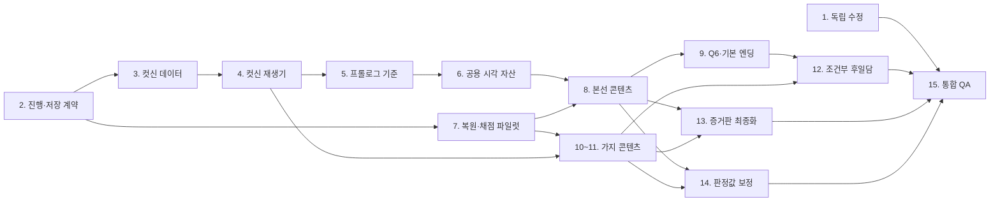

# 《안개항의 상속자》 잔여 작업 실행 로드맵

> 상태: 실행 전 순서 확정본
> 기준일: 2026-08-09
> 자산 계약: `docs/ASSET_SPEC.md`
> 복원 계약: `docs/RESTORATION_QUEST_SPEC.md`
> 구조 정본: `docs/QUEST_BRANCH.md`

## 0. 정렬 원칙

작업 순서는 다음 두 기준을 함께 적용한다.

1. **구조 의존성 우선** — 뒤 작업이 앞 작업의 데이터·런타임·저장 형식을 재사용하면 앞 작업을 먼저 한다.
2. **가벼운 독립 작업 우선** — 다른 구조를 흔들지 않는 짧은 수정은 초기에 끝내 미결 항목을 줄인다.

같은 우선순위라면 아래 순서를 따른다.

```text
정본·계약 → 상태·저장 → 공통 런타임 → 기준 샘플 → 공용 자산
→ 본선 세로 슬라이스 → 종점·엔딩 뼈대 → 가지 → 후일담 → 전체 보정
```

이미지부터 전량 생성하지 않는다. 런타임의 `background / portrait / insert / overlay / state`
필드와 복원 결과 저장 규격이 먼저 고정돼야 생성 파일을 다시 자르거나 이름을 바꾸는 일을 막을 수 있다.

---

## 1. 전체 순서 요약

| 순서 | 단계 | 우선 근거 | 작업량 | 주요 산출물 |
| :--: | --- | --- | :--: | --- |
| 0 | 정본·자산·복원 명세 잠금 | 모든 작업의 입력 | 완료 | `ASSET_SPEC.md`, `RESTORATION_QUEST_SPEC.md` |
| 1 | 가벼운 독립 수정 | 짧고 구조 영향이 작음 | S | 시작 화면 버튼, Q0 포스트잇 정합화 |
| 2 | 진행·저장 계약 | 컷신·작업대·증거판이 모두 의존 | M | 원자적 컷신 상태, 복원 결과 저장 규격 |
| 3 | 컷신 데이터 스키마·검증기 | 이미지·재생기의 공통 입력 | M | 17개 컷신 데이터, 정합성 검사 |
| 4 | 공통 컷신 재생기 | 모든 남은 컷신의 기반 | L | `src/cutscene.js`, 라우팅·재개 |
| 5 | 프롤로그 재제작 | 가장 가까운 시각 기준 샘플 | M | C0를 C0B 언어로 통일 |
| 6 | 공용 시각 자산과 정본 도형 | 본선 컷신·퀘스트가 반복 사용 | L | 배경·초상·3줄/4줄·문자 레이어 |
| 7 | 복원 자산 파이프라인·채점 파일럿 | 13개 퀘스트 반복 제작의 기반 | M | Q2B 파일럿, 결과 저장·썸네일 |
| 8 | 본선 콘텐츠를 플레이 순서로 완성 | 엔딩까지 가는 필수 경로 | XL | C1~C6, Q1A~Q5A |
| 9 | Q6 증거의 방·기본 엔딩 | 본선 완주 가능 상태 | L | 실 잇기, CE 엔딩 본문 |
| 10 | 선술집 가지 체인 | 서로 직렬 연결 | L | Q1B→Q5B와 컷신 |
| 11 | 단발 가지 3개 | 독립적이고 비교적 가벼움 | M | Q2C·Q3B·Q4C와 컷신 |
| 12 | 조건부 후일담·엔딩 완성 | 가지 완료 플래그에 의존 | M | 후일담 5종 |
| 13 | 증거판 이미지 최종화 | 모든 실제 복원 결과에 의존 | S~M | 임의 이미지 제거, fallback |
| 14 | 유사도 전 노드 보정 | 모든 목표·마스크가 필요 | M | 노드별 최종 판정값 |
| 15 | 전체 통합 QA | 모든 단계에 의존 | L | 본선·전 가지·재개·저장 검증 |

`S/M/L/XL`은 상대 작업량이며 일정 추정치가 아니다.

---

## 2. 의존 관계



핵심 경로는 `진행·저장 → 컷신 데이터 → 재생기 → 프롤로그 기준 → 공용 자산 → 본선
→ Q6·엔딩 → 후일담 → QA`다.

---

## 3. 단계별 실행안

## 1단계 — 가벼운 독립 수정

다른 시스템의 설계 결정을 기다리지 않아도 되는 작업을 먼저 닫는다.

### 1-1. 증거판의 시작 화면 버튼

- 증거판 픽셀 프레임 안에 `시작 화면` 버튼 배치
- `PixelScreen.hotspot()`을 사용해 키보드·스크린 리더 대응
- `index.html`로 돌아갈 때 진행도는 유지
- 버튼 포커스·hover는 CSS가 아니라 캔버스 픽셀 표시
- 좁은 화면 정수배 확대에서 클릭 영역 검증

### 1-2. `Q0_MONTAGE` 포스트잇 정본 정합화

- 이야기 정본의 세 문장으로 통일
  - 챙 넓은 회색 모자
  - 왼뺨 점
  - 해진 초록 목도리
- 현재 세 번째 코트색 문구는 필수 증언에서 제외
- Q0 목표 이미지에 왼뺨 점이 실제로 존재하는지 확인
- Q0 설정 테스트 갱신

### 완료 조건

- 시작 화면 버튼이 진행도를 지우지 않고 작동한다
- Q0의 문서·포스트잇·채점 특징이 같은 세 항목을 말한다
- 기존 테스트가 모두 통과한다

---

## 2단계 — 진행 상태와 저장 계약

이 단계를 먼저 끝내야 컷신 도중 종료, 작업대 통과, 증거판 썸네일이 서로 다른 상태를
기록하지 않는다.

### 2-1. 컷신 원자성

- 작업대 통과 시 `NODE_CLEARED_*`만 기록
- 해당 컷신을 실제로 끝낸 뒤에만 `CUTSCENE_SEEN_*` 기록
- 컷신 중 이탈하면 grants·해금 미적용
- 재접속 시 `QuestGraph.pendingCutscene()` 우선 재생
- 이미 본 컷신만 ESC 스킵 허용

### 2-2. 증거·증언 플래그

- 컷신별 `grants` ID 확정
- 자동 수집은 컷신 종료 시 일괄 적용
- 조건부 비트의 `if / unless` 평가 규칙 고정
- 가지 보조 목격담은 `NODE_CLEARED_*` 또는 별도 clue 플래그 중 하나로 통일

### 2-3. 복원 결과 저장

- 퀘스트별 완성 캔버스 저장 형식 결정
- 저장할 것: 버전, questId, gridSize, 팔레트 인덱스 배열, 완료 시각
- 저장하지 않을 것: 생성 원본, 정답 이미지, 내부 점수
- 증거판과 컷신이 같은 저장 결과를 읽는 API 설계
- 과거 세이브에 결과 이미지가 없을 때 `board-fallback` 사용

### 2-4. 테스트

- 통과 후 컷신 전 종료
- 컷신 중 종료 후 재개
- 컷신 종료 후 자식 노드 해금
- 같은 컷신 종료 콜백 중복 실행
- 구형 저장 데이터 마이그레이션

### 완료 조건

- 퀘스트 통과와 컷신 완료가 서로 다른 플래그로 보존된다
- 어느 시점에 브라우저를 닫아도 진행이 막히지 않는다
- 실제 복원 결과를 증거판·컷신에서 다시 읽을 수 있다

---

## 3단계 — 컷신 데이터 스키마와 정합성 검증

이미지를 만들기 전에 런타임이 요구할 자산 키를 고정한다.

### 3-1. 스키마

```js
{
  id,
  kind,
  place,
  beats: [{
    who, face, text, ms, when,
    visual: { background, state, insert, overlay, camera, transition }
  }],
  grants,
  unlocks
}
```

### 3-2. 17개 컷신 데이터화

- `07_CUTSCENES.md`의 문구·순서 그대로 이전
- `C4A` 경찰서→광장 전환 반영
- `C6B` 선술집→기억 배경 전환 반영
- `CE_ENDING` 경찰서→저택→조건부 장소→사무소 전환 반영
- 조건부 본선 상기 대사 4개 보존
- 조건부 후일담 5종 보존

### 3-3. 검증기

- 컷신 ID 중복·누락
- `QuestGraph.UNLOCKS`와 컷신 `unlocks` 교차 검사
- 화자·표정·배경·삽입 컷 자산 키 유효성
- 대사 3줄 초과 가능성
- 금지 정보 최초 공개 시점 검사
- opening 2 / bridge 10 / closing 4 / ending 1 개수 검사

### 완료 조건

- 17개 컷신이 코드 데이터로 존재한다
- 문서와 데이터의 대사 차이가 0건이다
- 모든 자산 키가 `ASSET_SPEC.md`의 ID를 사용한다

---

## 4단계 — 공통 컷신 재생기

C0B의 검증된 조작·타이핑 코드를 일반화한다.

### 4-1. 화면과 입력

- `PixelScreen` 640×384 사용
- 배경, 상태 오버레이, 좌우 초상, 삽입 컷, 대사창 합성
- 비활성 초상 런타임 감광
- 타이핑 완료 후 다음 비트로 넘어가는 2단계 입력
- 120ms 입력 잠금과 `visualLock` 지원
- 자동 진행·클릭·SPACE·ESC 규칙

### 4-2. 시각 전환

- `wide / speaker / insert-close / compare` 카메라
- `cut / fade / flash` 전환
- 비트 단위 배경·상태 변경
- 정확한 문자와 문양 overlay 합성
- 플레이어 실제 복원 결과 insert 지원

### 4-3. 종료 라우팅

- opening 마지막 → Q0 작업대
- bridge / closing → 증거판
- ending → 엔딩 후 증거판 또는 시작 화면
- 종료 시에만 grants·seen 기록

### 4-4. 테스트

- 조건부 비트 양쪽 경우
- 첫 관람 스킵 금지 / 재관람 스킵 허용
- 빠른 SPACE 연타
- 시각 잠금
- 종료 콜백 1회
- 이미지 로드 실패 fallback

### 완료 조건

- 임시 도형과 텍스트만으로도 17개 컷신을 처음부터 끝까지 재생할 수 있다
- 아직 최종 이미지가 없어도 게임 진행 검증이 가능하다

---

## 5단계 — 프롤로그 재제작

공통 재생기의 첫 실제 시각 샘플로 C0를 완성한다. 이 결과가 이후 자산의 최종 스타일
승인 기준이 된다.

### 작업 순서

1. `ASSET_SPEC`의 P01~P04 베이스 플레이트 제작
2. C0B의 플레이어 정체성·팔레트·광원과 대조
3. 7숏 구성: 창→책상→초상→점등→작업→위험→창/타이틀
4. 마지막 문 두드림과 C0B 열린 문의 공간 연속성 확인
5. C0B와 동일한 대사창·스캔라인·입력 규칙 적용
6. 시작부터 Q0 진입까지 연속 재생 검증

### 승인 게이트

- C0와 C0B를 연달아 봤을 때 다른 게임처럼 보이지 않는다
- 플레이어 얼굴·의상·사무소 구조가 유지된다
- 정본 9비트의 의미가 빠지지 않는다
- 이 승인을 받기 전에는 나머지 컷신 이미지를 대량 생성하지 않는다

---

## 6단계 — 공용 시각 자산과 정본 도형

반복 사용량이 높은 것부터 만든다.

### 6-1. 수동 정본 우선

1. `SYM_CREST_MAIN_3`
2. `SYM_CREST_BRANCH_4`
3. `SYM_ANCHOR_OLD`
4. 정확한 문자·도장 템플릿
5. 3줄↔4줄 비교 레이아웃

### 6-2. 배경 우선순위

1. 경찰서 — 핵심 컷신 반복 사용
2. 부두 — 마차 반전과 보조 목격담의 공간 기준
3. 저택 응접실 — 감정선의 시작과 끝
4. office 상태 오버레이 — 프롤로그와 마지막 컷 대칭
5. 서쪽 복도
6. 선술집·창고·광장 보정
7. 세이렌 호 기억 배경

### 6-3. 인물 우선순위

1. 플레이어·리드
2. 엘리너·카버·줄리언·뱅크스
3. 홀트·코라
4. 베스·램·부두 인부

인물마다 calm을 먼저 승인한 뒤 tense, high를 만든다.

### 완료 조건

- 3줄과 4줄이 모든 크기에서 명확히 구분된다
- 본선 컷신에 필요한 6명과 3개 핵심 장소가 준비된다
- 64×64 초상 정체성 검사를 통과한다

---

## 7단계 — 복원 파이프라인과 채점 파일럿

13개를 한꺼번에 만들기 전에 64×64 소형 자산 `Q2B_CAT`으로 전 과정을 검증한다.
이 단계는 개발용 직접 진입으로 수행하며 실제 해금 순서를 바꾸지 않는다.

### 7-1. 자산 파이프라인

- 생성 원본 → 크롭 → 노드 gridSize 축소 → 제한 팔레트 양자화
- 선화 분리와 닫힌 영역 확인
- 의미 영역 mask 제작
- `manifest.json` 작성
- `board-fallback.png` 파생

### 7-2. 작업대 연결

- 공통 설정 레지스트리에 Q2B 등록
- 포스트잇 3개 표시
- 캔버스 결과 저장
- 증거판 썸네일 및 컷신 insert 재사용 확인

### 7-3. 유사도 파일럿

- 색 / 경계 / 구조 / 팔레트 네 축 유지
- 정답을 아는 완성본, 합리적 부분 완성본, 오답 3종으로 분포 측정
- 숫자는 UI에 노출하지 않고 정성 피드백만 표시
- 낮은 결과에서도 캔버스 유지

### 완료 조건

- 하나의 target이 작업대·증거판·컷신에 동일하게 나타난다
- 저장 후 새로고침해도 결과가 유지된다
- 합리적인 그림은 통과하고 명백한 오답은 실패한다
- 이 파이프라인을 나머지 12개에 반복할 수 있다

---

## 8단계 — 본선 콘텐츠를 플레이 순서로 확장

한 레이어씩 `컷신 → 퀘스트 → 다음 컷신 → 증거판`을 완성한다. 이미지 종류별로 몰아서
만들지 않고, 실제 플레이 가능한 세로 슬라이스를 오른쪽으로 한 칸씩 늘린다.

### 8-0. 튜토리얼 뒤 다리

- `C1_THE_CASE` 최종 자산·데이터
- Q0 실제 결과를 수배 전단과 증거판에 사용
- C1 종료 후 처음 증거판이 나타나는 연출

### 8-1. L1→L2

- `Q1A_IDEALIZED`
- `C2A_WHAT_WAS_ERASED`
- 덧칠 발견을 먼저, 미화 한계를 나중에 제시
- Q2A와 Q2C의 당위가 모두 전달되는지 검사

### 8-2. L2→L3

- `Q2A_TRUE_FACE`
- `C3A_THE_SEAL_HE_DREW`
- 턱·왼눈썹·흉터 불일치
- 카버의 4줄만 공개, 진품 3줄 금지

### 8-3. L3→L4

- `Q3A_SEAL`
- `C4A_WET_LEDGER`
- 진품 3줄 공개
- “배운 문양 → 넉 달 비용 → 장부” 논리 연결 검증

### 8-4. L4→L5

- `Q4A_LEDGER`
- `C5A_THE_BLACK_CARRIAGE`
- `T.C.`와 넉 달 치 비용 공개
- 기억 속 마차 문양은 식별 불가 상태 유지

### 8-5. L5→L6

- `Q5A_DOCK`
- `C6_EVIDENCE_WALL`
- 마차 4줄 최초 공개
- 3줄·4줄 비교
- 줄리언 이름은 아직 공개하지 않음

### 각 묶음의 공통 완료 조건

- target / line / mask / manifest / fallback 완비
- 포스트잇이 이미 획득한 정보만 사용
- 통과·실패·재제출·저장 테스트
- 후속 컷신 종료 후 정확한 자식만 해금
- 증거판에 실제 복원 결과 표시
- 해당 지점까지 새 게임으로 연속 플레이 가능

---

## 9단계 — `Q6_FINALE` 증거의 방과 기본 엔딩

본선만으로 게임을 완주할 수 있게 만든다. 조건부 후일담은 아직 넣지 않아도 된다.

### 9-1. Q6 증거판 조작

- 열린 가지가 남으면 픽셀 UI 확인창
- Q3A 봉인과 Q5A 마차 결과를 플레이어가 직접 실로 연결
- 실패 없는 조작
- 연결 전에는 범인 이름 비공개
- 연결 완료 후 `CE_ENDING` 진입

### 9-2. CE_ENDING 본문

- 등록부에서 줄리언 이름 최초 공개
- 경찰서 대질
- 실제 3줄·4줄 복원물 비교
- `T.C.` 장부와 카버 반응
- 저택에서 Q2A 실제 초상 전달
- 완성된 증거판과 걷힌 안개

### 완료 조건

- 본선만 따라 새 게임→단일 엔딩 완주 가능
- 범인 이름이 Q6 연결 전에 어떤 이미지·대사에도 나오지 않는다
- 엔딩에 정적 정답 대신 실제 플레이 결과가 사용된다

---

## 10단계 — 선술집 가지 체인

직렬 의존성이 있으므로 아래 순서를 바꾸지 않는다.

1. `Q1B_TAVERN_WALL` + `C2B_THE_WALL`
2. `Q2B_CAT` + `C3B_THE_FLYER` — 파일럿 결과를 정식 흐름에 편입
3. `Q3C_WAREHOUSE` + `C4C_WHAT_THE_CAT_FOUND`
4. `Q4B_LOGBOOK` + `C5B_A_WEEK_BEFORE`
5. `Q5B_SIREN` + `C6B_THAT_NIGHT`

### 체인 검수

- 본선을 하나도 하지 않고 끝까지 진행 가능
- 각 컷신의 본선 상기 조건부 대사가 형제 완료 순서와 모순되지 않음
- Q3C는 상자·젖은 돌 배치만 Q5A에 보조
- Q4B는 두 번째 기둥 위치만 Q5A에 보조
- 어느 자산에도 파도 수·줄리언·마차 주인이 노출되지 않음
- Q5B의 에드먼드는 난간을 붙잡은 두려운 열여덟 살

---

## 11단계 — 단발 가지 3개

서로 직접 의존하지 않으므로 작은 것부터 처리한다.

1. `Q3B_TATTOO` + `C4B_TOO_NEW` — 64, 소품 근접
2. `Q4C_SQUARE_BET` + `C5C_THE_PAINTER` — 64, 자화상
3. `Q2C_CHILD_ROOM` + `C3C_THE_DOOR` — 128, 후일담·Q2A 보조 연결 포함

Q2C는 자산 크기만 보면 가볍지만 엘리너 감정선과 Q2A 조건부 포스트잇에 영향을 주므로
두 단발 가지보다 뒤에서 통합한다.

### 완료 조건

- 막다른 가지가 짧은 closing 후 증거판으로 돌아온다
- 본선 진행을 잘못 해금하지 않는다
- 조건부 본선 상기 문구가 완료 순서와 충돌하지 않는다

---

## 12단계 — 조건부 후일담과 엔딩 완성

모든 가지 플래그가 실제로 존재한 뒤 추가한다.

1. Q3B 문신 자백 한 줄 — 신규 이미지 거의 없음
2. Q3C 선술집 창가의 고양이
3. Q4C 광장의 램 복제품
4. Q2C 열린 서쪽 복도 문
5. Q5B 세이렌 호 그림 전달과 사망 신고서 — 가장 긴 후일담

### 조합 테스트

- 가지 0개
- 각 가지 1개씩
- 후일담 대상 가지 전부
- 엔딩을 본 뒤 가지를 추가 완료하고 Q6 재진입

### 완료 조건

- 엔딩 본문은 항상 동일하다
- 완료한 가지의 후일담만 추가된다
- 미완료 자산은 미리 로드 화면이나 증거판에 노출되지 않는다

---

## 13단계 — 증거판 이미지 최종화

결과 저장은 7단계부터 계속 연결하지만, 모든 퀘스트가 준비된 뒤 마지막 누락을 한 번에 검사한다.

- 임의 색 블록 fallback 전면 제거
- OPEN은 뒤집힌 종이만 표시
- CLEARED는 실제 플레이 결과 표시
- 과거 저장만 `board-fallback` 사용
- Q6 전용 종점 카드
- 모든 썸네일의 핵심 크롭 확인
- 시작 화면 버튼 최종 위치 재검사

### 완료 조건

- 15개 카드 어느 상태에서도 임의 이미지가 나오지 않는다
- 작업대·컷신·증거판의 같은 복원물이 시각적으로 동일하다

---

## 14단계 — 유사도 기준 전 노드 보정

명세의 네 프로필과 노드별 통과 계약을 구현하고, 마스크와 fixture로 오판정만 보정한다.

### 보정 순서

1. 64: Q0, Q2B, Q3B, Q4C
2. 128: Q1B, Q2C, Q3A, Q4B, Q5B
3. 128 인물·문서: Q1A, Q2A, Q4A
4. 128 특수 현장: Q3C, Q5A

### 테스트 표본

각 노드마다 최소 다음 5개를 만든다.

- 정답 완성본
- 색은 맞고 일부 구조가 틀린 본
- 구조는 맞고 색이 틀린 본
- 핵심 특징 하나가 빠진 본
- 절반 이하만 칠한 본

### 원칙

- 점수·통과선은 플레이어에게 공개하지 않음
- 결정 특징이 빠지면 전체 평균이 높아도 통과하지 않음
- 보조 목격담은 통과 요건을 늘리지 않음
- 낮은 점수에서 현재 그림 유지
- 피드백은 가장 약한 영역을 증언형 문장으로 안내

### 완료 조건

- 모든 노드에 재현 가능한 판정 fixture가 있다
- 합리적 변형을 과도하게 탈락시키지 않는다
- 핵심 단서 누락을 평균 점수가 덮지 못한다

---

## 15단계 — 전체 통합 QA

### 진행 경로

- 본선만 완주
- 선술집 가지만 먼저 끝낸 뒤 본선
- 각 단발 가지를 형제보다 먼저·나중에 완료
- 전 퀘스트 완주
- 엔딩 후 남은 가지 완료와 엔딩 재진입

### 중단·재개

- 각 컷신 중간 종료
- 각 퀘스트 통과 직후 종료
- Q6 확인창·실 연결 중 종료
- 엔딩 단계별 종료
- 구형 저장 데이터 로드

### 서사 회귀 검사

- 3줄과 4줄 최초 공개 시점
- `T.C.` 공개 시점
- 마차 주인 이름 공개 시점
- 가지에서 결정적 증거 미노출
- 조건부 대사가 형제 완료 순서와 모순되지 않음
- 모든 노드의 “왜 그려야 하는가”가 진입 전에 전달됨

### 화면·접근성

- 640×384, 정수배 확대
- 한글 3줄 제한과 잘림
- 키보드만으로 전 과정 진행
- 첫 관람 스킵 제한
- 이미지 로드 실패 fallback
- 시작 화면 복귀 후 이어하기

### 최종 완료 조건

- 새 저장으로 본선과 전체 경로를 각각 완주할 수 있다
- 논리 모순·진행 막힘·임의 이미지가 0건이다
- 모든 실제 복원 결과가 컷신·증거판·엔딩에서 동일하게 재사용된다
- 자동 테스트와 수동 시각 검수가 모두 통과한다

---

## 16. 작업 단위 운영 규칙

각 단계는 아래 순서로만 닫는다.

1. 정본 문구와 자산 ID 확인
2. 구현 또는 생성
3. 단위 테스트
4. 해당 지점까지 실제 플레이
5. 스토리 최초 공개 시점 검수
6. 문서와 manifest 갱신
7. 다음 단계로 이동

한 단계의 완료 조건을 통과하지 못하면 다음 단계로 넘어가지 않는다. 특히 프롤로그 스타일
승인 전 컷신 대량 생성, Q2B 파일럿 전 퀘스트 이미지 전량 생성, 본선 완주 전 후일담 제작은
하지 않는다.

## 17. 작업 중 함께 묶어야 하는 것

아래 항목은 따로 완료 처리하지 않는다.

- 퀘스트 target + line + mask + 포스트잇 + manifest
- 퀘스트 통과 + 완료 컷신 + 자식 해금 + 증거판 결과
- 컷신 배경 + 초상 + insert + 정확한 overlay
- 조건부 가지 플래그 + 포스트잇 보조 문구 + 엔딩 후일담
- 목표 이미지 + 채점 fixture + 정성 피드백

이 묶음을 지키면 “이미지는 있는데 플레이할 수 없음”, “컷신은 있는데 다음 노드가 안 열림”,
“증언과 정답이 다름” 같은 반제품 상태를 줄일 수 있다.
