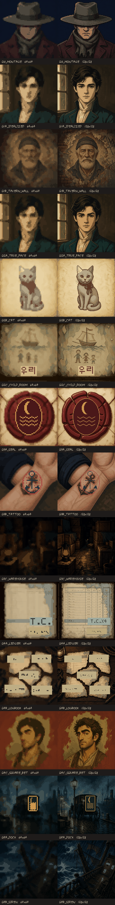

# 복원 퀘스트 픽셀 정본 후보 QA

> 상태: **64×64·128×128 비교 후보 생성 완료**
> 생성 방식: 결정론적 Pillow/OpenCV 파이프라인 + 수동 정본 문자·문양 합성
> 정본 영역 계약: `docs/RESTORATION_QUEST_SPEC.md` 2.4절

## 산출물

각 퀘스트의 `assets/quests/<quest>/candidates/<resolution>/`에 `target.png`,
`line.png`, `initial.png`, `mask-overlay.png`, `fill-regions.png`, `manifest.json`,
그리고 `masks/initial.png`, `locked.png`, `restore.png`, `exclude.png`, `line.png`가 있다.
사용 가능한 해상도는 64×64와 128×128 두 종류이며, 두 후보의 육안 비교 뒤 최종 선택한다.

## 복원 위치의 확정 수준

- `masks/restore.png`의 흰 픽셀은 플레이어가 수정하고 전체 유사도 채점에 사용할 복원 영역 합집합이다.
- `initial`, `locked`, `exclude`, `line`도 픽셀 단위로 확정돼 복원 영역과 분리돼 있다.
- 모자·점·목도리처럼 하드 게이트마다 나뉜 `masks/required/<feature>.png`는 아직 제작하지 않았다.
- 따라서 현재 후보는 전체 복원 위치까지 확정된 상태이며, 세부 단서별 채점과 게임 런타임 연결은 후속 단계다.

## 자동 검증 결과

| 퀘스트 | 해상도 | 팔레트색 | 복원 비율 | 비율 | 폐쇄 구획 | 4방향 누출 | 8방향 누출 | 문자 위험 |
| --- | ---: | ---: | ---: | :--: | ---: | ---: | ---: | :--: |
| Q0_MONTAGE | 64 | 16 | 34.9% | 통과 | 18 | 0 | 0 | 해당 없음 |
| Q0_MONTAGE | 128 | 24 | 34.9% | 통과 | 34 | 0 | 0 | 해당 없음 |
| Q1A_IDEALIZED | 64 | 16 | 33.0% | 통과 | 44 | 0 | 0 | 해당 없음 |
| Q1A_IDEALIZED | 128 | 24 | 32.8% | 통과 | 74 | 0 | 0 | 해당 없음 |
| Q1B_TAVERN_WALL | 64 | 16 | 27.9% | 통과 | 22 | 0 | 0 | 해당 없음 |
| Q1B_TAVERN_WALL | 128 | 24 | 27.8% | 통과 | 33 | 0 | 0 | 해당 없음 |
| Q2A_TRUE_FACE | 64 | 16 | 38.1% | 통과 | 38 | 0 | 0 | 해당 없음 |
| Q2A_TRUE_FACE | 128 | 24 | 37.9% | 통과 | 71 | 0 | 0 | 해당 없음 |
| Q2B_CAT | 64 | 16 | 32.9% | 통과 | 39 | 0 | 0 | 해당 없음 |
| Q2B_CAT | 128 | 24 | 33.1% | 통과 | 73 | 0 | 0 | 해당 없음 |
| Q2C_CHILD_ROOM | 64 | 18 | 28.2% | 통과 | 22 | 0 | 0 | 높음 |
| Q2C_CHILD_ROOM | 128 | 26 | 27.8% | 통과 | 49 | 0 | 0 | 낮음 |
| Q3A_SEAL | 64 | 18 | 22.1% | 통과 | 29 | 0 | 0 | 해당 없음 |
| Q3A_SEAL | 128 | 26 | 22.9% | 통과 | 62 | 0 | 0 | 해당 없음 |
| Q3B_TATTOO | 64 | 18 | 17.7% | 통과 | 48 | 0 | 0 | 해당 없음 |
| Q3B_TATTOO | 128 | 26 | 17.8% | 통과 | 83 | 0 | 0 | 해당 없음 |
| Q3C_WAREHOUSE | 64 | 16 | 33.0% | 통과 | 8 | 0 | 0 | 해당 없음 |
| Q3C_WAREHOUSE | 128 | 24 | 33.1% | 통과 | 9 | 0 | 0 | 해당 없음 |
| Q4A_LEDGER | 64 | 19 | 23.1% | 통과 | 9 | 0 | 0 | 높음 |
| Q4A_LEDGER | 128 | 27 | 22.9% | 통과 | 11 | 0 | 0 | 낮음 |
| Q4B_LOGBOOK | 64 | 18 | 22.8% | 통과 | 20 | 0 | 0 | 높음 |
| Q4B_LOGBOOK | 128 | 26 | 22.8% | 통과 | 62 | 0 | 0 | 중간 |
| Q4C_SQUARE_BET | 64 | 16 | 27.3% | 통과 | 15 | 0 | 0 | 해당 없음 |
| Q4C_SQUARE_BET | 128 | 24 | 27.9% | 통과 | 57 | 0 | 0 | 해당 없음 |
| Q5A_DOCK | 64 | 18 | 32.9% | 통과 | 15 | 0 | 0 | 해당 없음 |
| Q5A_DOCK | 128 | 26 | 32.9% | 통과 | 51 | 0 | 0 | 해당 없음 |
| Q5B_SIREN | 64 | 16 | 28.0% | 통과 | 3 | 0 | 0 | 해당 없음 |
| Q5B_SIREN | 128 | 24 | 28.0% | 통과 | 6 | 0 | 0 | 해당 없음 |

## 폐쇄 윤곽 계약

- 모든 복원 의미 영역의 외곽선을 `line` 마스크에 강제로 합성했다.
- 순수 대각선 1픽셀 틈을 직교 픽셀로 메운 뒤 4방향·8방향 채우기를 각각 검사한다.
- `fill_leaks_4way`와 `fill_leaks_8way`가 0이 아니면 후보를 게임에 사용할 수 없다.
- 선 픽셀은 `locked`이며 `restore`·`exclude`와 겹치지 않는다.

## 수동 정본 보정

- Q2C: `우리`를 직접 정의한 이진 비트맵 획으로 다시 합성했다.
- Q3A: 초승달 하나와 파도 정확히 세 줄인 `SYM_CREST_MAIN_3`를 합성했다.
- Q3B: 재사용 가능한 `SYM_ANCHOR_OLD` 닻을 합성했다.
- Q4A: 관리 서명과 `T.C. 4 MONTHS` 행을 임의 생성 획 대신 정본 문자로 합성했다.
- Q4B: `자정`, `검은 마차`, `두 번째 기둥 옆`, `토마스가 탔다`, `사흘째 같은 자리`를 정확히 합성했다.
- Q5A: 초승달 하나와 파도 정확히 네 줄인 `SYM_CREST_BRANCH_4`를 합성했다.
- 공유 문양은 `assets/quests/shared/symbols/<resolution>/`에도 저장했다.

## 육안 선택 시 확인할 것

1. 64×64에서 핵심 단서 개수가 보이지만 인물 정체성이나 문서 문구가 뭉개지는지 확인한다.
2. 128×128이 단서와 플레이 시간 사이의 균형을 제공하는지 확인한다.
3. Q1A와 Q2A는 반드시 같은 128×128 해상도와 크롭을 유지한다.
4. 문서·현장형 Q3C·Q4A·Q5A는 128×128을 기본값으로 유지한다.
