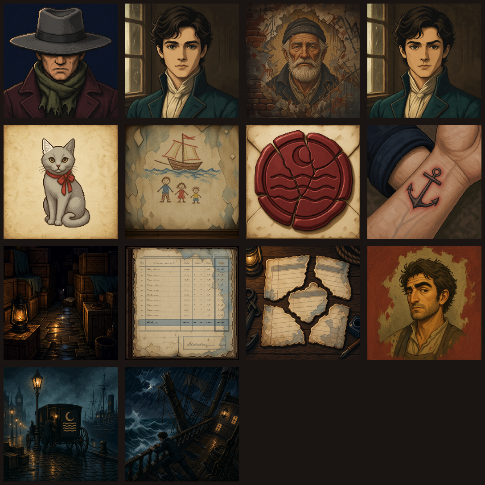

# 14개 복원 퀘스트 구 원본 이미지 생성·검수 기록

> 상태: **역사 기록 · 게임 비정본**
> 2026-08-10 이후 게임 정본은 `assets/questimage/*__완성이미지.png`와
> `*__윤곽선.png`다. 현재 계약은 `docs/RESTORATION_QUEST_SPEC.md`를 따른다.
> 생성일: 2026-08-09
> 생성 방식: Codex 내장 ImageGen (`stylized-concept`, Q2A는 Q1A 참조 편집)
> 정본 영역 계약: `docs/RESTORATION_QUEST_SPEC.md` 2.4절

## 1. 산출물 범위

14개 퀘스트에 대해 `assets/quests/<quest>/source/generated-original.png`와 최종 생성
프롬프트 `source/prompt.txt`를 저장했다. 모든 원본은 1254×1254 RGB PNG다.

이 파일은 제작 원본이며 아직 게임용 `target.png`, `line.png`, `masks/*.png`가 아니다.
후속 단계에서 퀘스트별 64·128 정본으로 재구성하고 제한 팔레트로 양자화한다.

컨택트 시트는 왼쪽 위부터 Q0, Q1A, Q1B, Q2A, Q2B, Q2C, Q3A, Q3B, Q3C,
Q4A, Q4B, Q4C, Q5A, Q5B 순서다.

## 2. 퀘스트별 논리 검수

| 퀘스트 | 결과 경로 | 검수한 핵심 | 정본화 때 별도 처리 |
| --- | --- | --- | --- |
| Q0 | `q0-montage/source/generated-original.png` | 모자가 두 눈을 가림, 점은 화면 오른쪽 뺨 하나, 초록 목도리 | 기존 Q0 선화와 새 원본 중 정본 구도 선택 |
| Q1A | `q1a-idealized/source/generated-original.png` | 부드러운 턱, 대칭 눈썹, 흉터 없음, 창가 빛 | 관자놀이 이중 물감층은 완료 오버레이로 분리 |
| Q1B | `q1b-tavern-wall/source/generated-original.png` | 늙은 페리, 흰 수염, 아래층 얼굴, 카버와 비유사 | 가장자리 낙서는 채점 제외 |
| Q2A | `q2a-true-face/source/generated-original.png` | Q1A와 같은 인물·크롭, 각진 턱, 화면 오른쪽 눈썹 상승, 화면 왼쪽 흉터 | Q1A와 같은 128 그리드에 정렬 |
| Q2B | `q2b-cat/source/generated-original.png` | 회색 고양이, 흰 귀 정확히 하나, 붉은 리본 | 전단 문자는 넣지 않음 |
| Q2C | `q2c-child-room/source/generated-original.png` | 배 정확히 1척, 사람 정확히 3명 | `우리`는 수동 픽셀 레이어 |
| Q3A | `q3a-seal/source/generated-original.png` | 초승달 하나, 굵은 파도 띠 정확히 3줄 | `SYM_CREST_MAIN_3` 수동 정본으로 교체 |
| Q3B | `q3b-tattoo/source/generated-original.png` | 닻 하나, 선명한 잉크, 붉은 피부, 날짜 없음 | 동일 닻을 컷신 삽입 컷에도 재사용 |
| Q3C | `q3c-warehouse/source/generated-original.png` | 창문 없음, 상자·젖은 바닥·고양이 틈, 고양이 흰 귀 하나와 붉은 리본 | 종이 뭉치 내용은 끝까지 비가독 |
| Q4A | `q4a-ledger/source/generated-original.png` | 장부 격자, 지출 열, 결정 행 자리, 마차·문장 없음 | 임의 획 제거 후 서명·`T.C.` 수동 합성 |
| Q4B | `q4b-logbook/source/generated-original.png` | 찢어진 조각 정확히 5개, 문자 자리 확보, 소유자·문장 없음 | 일지 문구 전체를 수동 픽셀 레이어로 합성 |
| Q4C | `q4c-square-bet/source/generated-original.png` | 굽은 코, 두꺼운 오른눈썹, 네모난 턱, 사건 인물과 비유사 | 이후 램 컷신 초상의 정체성 기준으로 사용 |
| Q5A | `q5a-dock/source/generated-original.png` | 가스등·검은 마차·카버 실루엣·정박선, 주인 미노출, 문양 4줄 | `SYM_CREST_BRANCH_4`로 교체해 줄 수 보증 |
| Q5B | `q5b-siren/source/generated-original.png` | 기울어진 배, 난간을 두 손으로 붙든 청년, 구조·영웅 포즈 없음 | 얼굴 식별 영역은 채점·증거에서 제외 |

## 3. 재생성 이력

- Q0 1차: 점이 잘못된 뺨에 있어 화면 오른쪽 뺨 하나로 정밀 편집
- Q2A 1차: 흉터가 잘못된 관자놀이에 있어 Q1A 정체성을 유지한 채 위치 교정
- Q3A 1차: 파도 홈이 여섯 줄처럼 보여 폐기하고 굵은 단일 파도 띠 세 줄로 재생성

폐기한 변형은 프로젝트에 넣지 않았다. 선택한 최종 원본만 `generated-original.png`로
보존했다.

## 4. 픽셀 정본 후보 단계로의 인계

이 원본을 사용해 다음 비교 후보 제작을 완료했다.

- 14개 × 2해상도, 총 28개의 `target.png`
- 제한 팔레트 양자화와 정확한 문자·문양 정본 합성
- 폐쇄 `line.png`와 초기 표시·잠금·복원·제외 마스크
- 4방향·8방향 채우기 누출 자동 검사
- 퀘스트별 비교 시트와 전체 접촉 시트

결과와 QA 수치는 `docs/RESTORATION_PIXEL_QA.md`에서 관리한다. 아직 퀘스트별 최종
해상도를 선택하지 않았으므로 `source/generated-original.png`뿐 아니라 `candidates/`도
게임 런타임에 직접 연결하면 안 된다. 다음 단계는 육안 비교로 최종 후보를 선택한 뒤
게임용 고정 경로로 승격하고 유사도 fixture를 보정하는 것이다.
